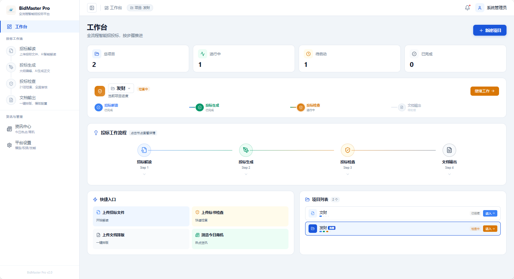
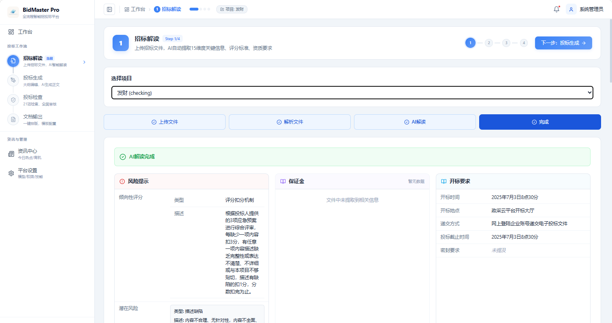
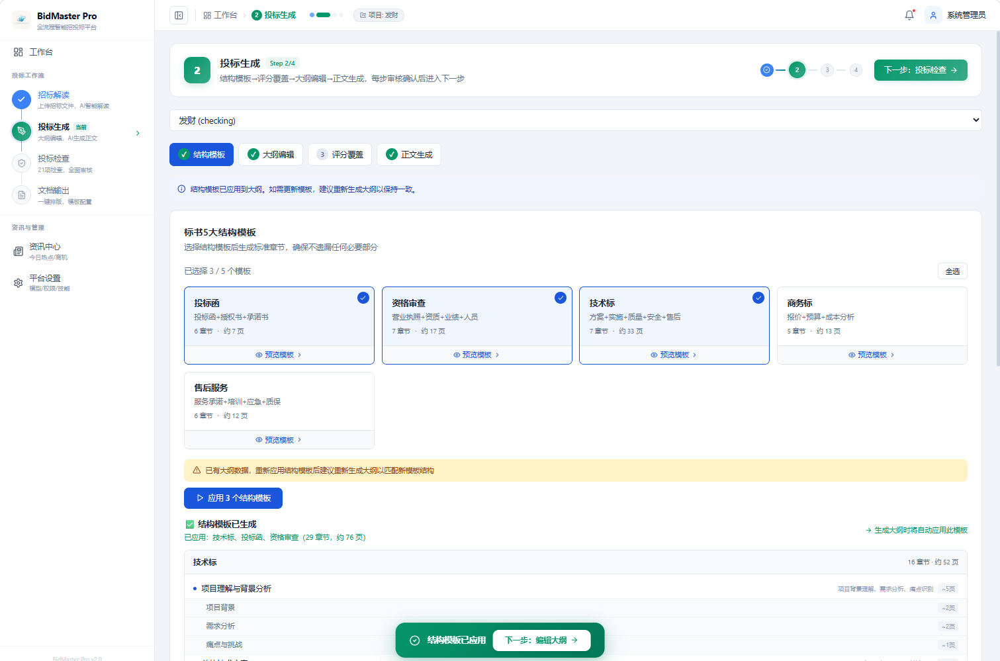
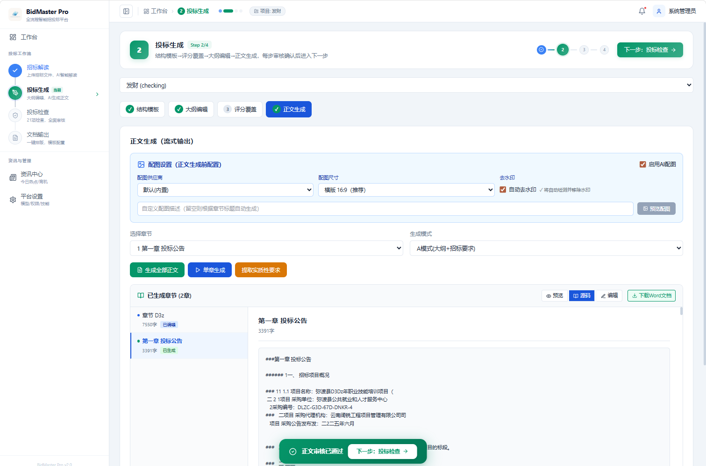
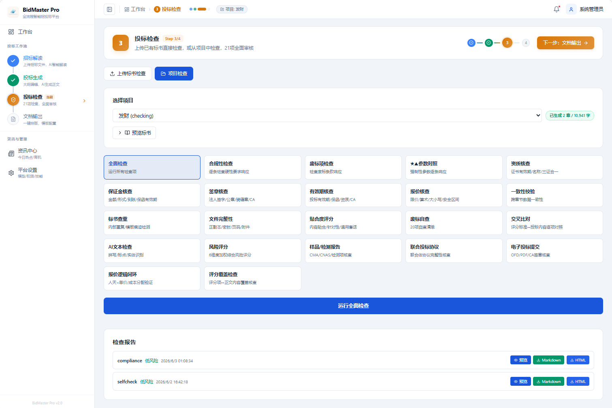
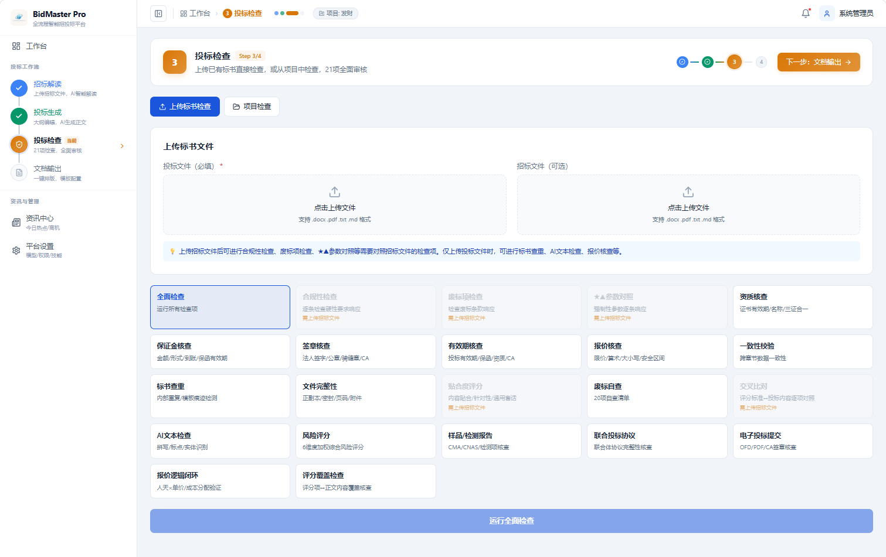
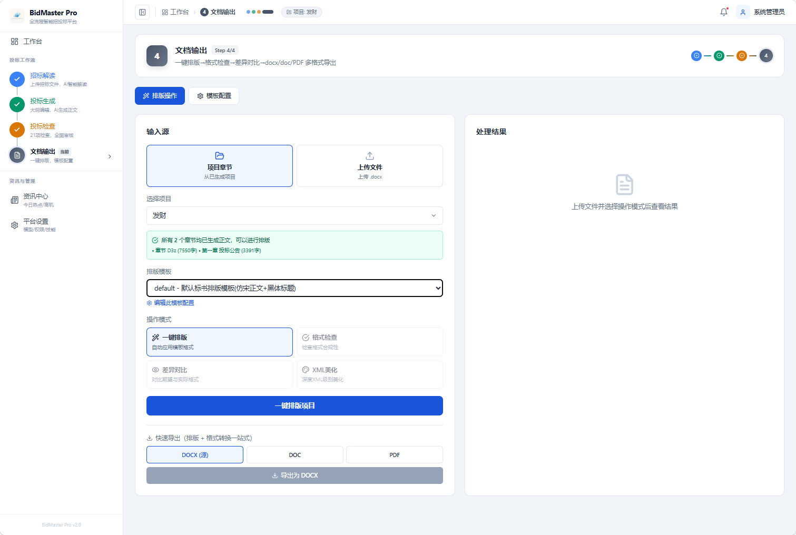
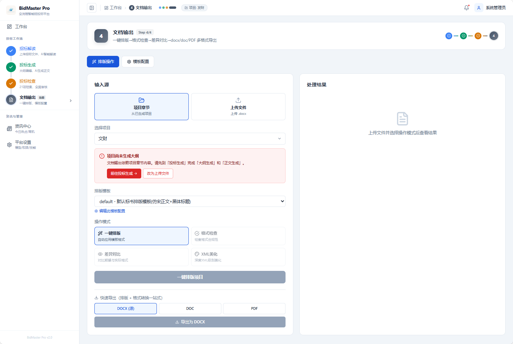
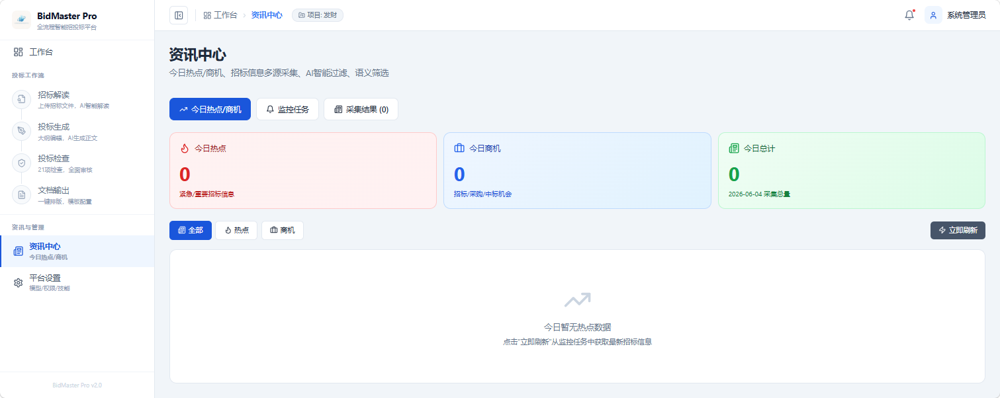

# BidMaster Pro - 全流程智能招投标平台

<div align="center">


**AI 智能招投标助手 · 标书生成 · 投标生成 · 投标检查 · 文档排版 全流程自动化**

[功能特性](#功能特性) • [界面预览](#界面预览) • [技术架构](#技术架构) • [快速开始](#快速开始) • [项目结构](#项目结构) • [更新日志](#-更新日志) • [联系作者](#-联系作者)

[](#-联系作者)

</div>

> 🚀 **全流程智能招投标 Agent**：4 阶段流水线（**招标解读 / 投标生成 / 投标检查 / 文档排版**），多 Agent 协同 + 可编排工作流，**21 项专业合规检查规则**、**多 LLM 供应商灵活切换**（DeepSeek / 硅基流动 / OpenAI / 通义等），轻量级 Skill 引擎 + 可插拔能力，RAG 知识库（支持**语义重排**与公司画像过滤），MinerU 扫描件 OCR 抽取，商机监控 + 今日热点聚合，桌面客户端 / 服务端 / Docker 一键部署。喜欢给个 ⭐ Star！

---

## 📋 项目简介

BidMaster Pro 是基于 AI Agent 架构的全流程智能招投标平台。通过 LLM（大语言模型）、RAG（检索增强生成）和 Skill Engine（技能引擎）三大核心引擎，实现从**招标文件解读**、**投标书自动生成**、**合规性检查**到**文档排版输出**的完整工作流自动化。

- **智能标书生成**: 自动理解招标文件，一键生成高质量投标书
- **投标流程自动化**: 大纲生成、内容填充、格式排版一键完成
- **21 项合规检查**: 保证金 / 签字盖章 / 有效期 / 一致性 / 重复率 / 价格合理性等全方位审核
- **多 LLM 灵活切换**: DeepSeek / 硅基流动 / OpenAI / 通义千问 / Ollama 本地模型，可热切换
- **RAG 知识库**: 企业资料 / 历史标书向量化存储 + 语义重排 + 公司画像过滤
- **商机监控**: 招投标公告自动抓取 + 今日热点聚合 + 关键词精准匹配

---

## 📸 界面预览


| 页面 | 预览 |
| :--- | :---: |
| **工作台** |  |
| **招标解读** |  |
| **投标生成 - 结构模板** |  |
| **投标生成 - 正文生成** |  |
| **投标检查 - 项目模式** |  |
| **投标检查 - 上传文件模式** |  |
| **文档输出** |  |
| **文档输出（无正文）** |  |
| **咨询中心** |  |

---

## ✨ 功能特性

### 🎯 核心工作流

#### 1. 招标解读 (Interpret)
- **智能文档解析**: 支持 PDF/DOCX/TXT 等多格式招标文件解析
- **关键信息提取**: 自动识别评分标准、资质要求、技术参数等核心要素
- **风险预警**: 多维度风险评估，标记潜在废标风险点
- **评分矩阵**: 自动生成评分细则对照表

#### 2. 投标生成 (Generate)
- **大纲生成**: 基于招标文件智能生成投标文件大纲
- **内容创作**: AI 辅助撰写各章节内容，支持扩写和优化
- **知识检索**: RAG 引擎提供企业知识库和历史案例参考
- **AI 配图**: 智能生成配套图表和示意图

#### 3. 投标检查 (Check)
- **合规性检查**: 检查是否符合招标文件强制性要求
- **资格审查**: 验证企业资质、业绩、人员等资格条件
- **一致性校验**: 确保前后文数据、金额、日期等信息一致
- **重复率检测**: 避免内容过度重复或抄袭
- **价格合理性**: 分析报价逻辑和竞争性
- **21 项专业检查**: 涵盖保证金、签字盖章、有效期等全方位审核

#### 4. 文档输出 (Format)
- **智能排版**: 自动调整格式、字体、段落样式
- **模板配置**: 支持自定义投标文件模板
- **多格式导出**: docx (源) / doc / PDF 三种格式一键导出，docx 为唯一中间格式
- **格式检查 / 差异对比**: 与期望模板逐项对比，可自动修正
- **修订模式**: 支持多人协作审阅和批注

#### 5. MinerU OCR 集成
- **扫描件抽取**: 接入 MinerU 云端 SaaS 或自部署 OpenAPI 服务，从扫描件 PDF / 图片中抽取结构化文字与版面
- **平台化配置**: `平台设置 → MinerU OCR` Tab 统一管理（云端 / 自部署、API Key、endpoint、超时、轮询策略）
- **API 调用**: `POST /api/mineru/ocr` 上传任意文档即可获得 markdown 结果，可被解读/检查流程复用

### 🚀 辅助功能

#### 咨询中心
- **AI 智能问答**: 基于知识库与招标文件，提供项目相关的政策、流程、规则问答
- **多轮对话**: 支持上下文记忆，可逐步细化问题
- **资料引用**: 回答中自动附带来源片段，便于追溯
- **角色化回复**: 根据当前用户的角色给出不同视角的建议

#### 资讯中心
- **商机监控**: 定时抓取招投标网站最新公告
- **关键词过滤**: 精准匹配关注的行业和地区
- **热度分析**: AI 评估项目价值和竞争程度

#### 知识库管理
- **向量检索**: 基于 ChromaDB 的语义搜索
- **文档管理**: 企业资料、历史标书、产品手册集中管理
- **智能问答**: 基于知识库的 Q&A 助手

#### 权限管理 (RBAC)
- **角色定义**: 管理员、项目经理、编写员、审核员
- **细粒度权限**: 菜单级和操作级权限控制
- **团队协作**: 多用户协同编辑和审核

---

## 🏗️ 技术架构

### 系统架构图

```
┌─────────────────────────────────────────────────────┐
│                  Desktop Client                      │
│         React + Electron + TypeScript                │
└──────────────────┬──────────────────────────────────┘
                   │ REST API
┌──────────────────▼──────────────────────────────────┐
│                 FastAPI Server                       │
│              (Python 3.12+)                          │
├─────────────────────────────────────────────────────┤
│  Router Layer                                        │
│  ├── Projects  ├── Interpret  ├── Generate          │
│  ├── Check     ├── Format     ├── Skills            │
│  ├── News      ├── Knowledge  ├── RBAC              │
│  └── AI-Image                                       │
├─────────────────────────────────────────────────────┤
│  Core Engines                                        │
│  ┌──────────────┐ ┌──────────────┐ ┌──────────────┐│
│  │ Agent Engine │ │ Skill Engine │ │  RAG Engine  ││
│  │  LangGraph   │ │  Plugin Sys  │ │  ChromaDB    ││
│  └──────────────┘ └──────────────┘ └──────────────┘│
│  ┌──────────────┐ ┌──────────────┐                  │
│  │  LLM Gateway │ │ Doc Engine   │                  │
│  │  LiteLLM     │ │ Multi-Parser │                  │
│  └──────────────┘ └──────────────┘                  │
├─────────────────────────────────────────────────────┤
│  Infrastructure                                      │
│  ├── PostgreSQL (AsyncPG)                           │
│  ├── Redis (Celery Broker)                          │
│  ├── MinIO (Object Storage)                         │
│  └── Celery Worker (Async Tasks)                    │
└─────────────────────────────────────────────────────┘
```

### 核心技术栈

#### 后端 (Backend)
| 技术 | 用途 | 版本 |
|------|------|------|
| **FastAPI** | Web 框架 | >=0.115 |
| **Python** | 编程语言 | >=3.12 |
| **SQLAlchemy** | ORM 框架 | >=2.0 |
| **PostgreSQL** | 关系数据库 | 16 |
| **AsyncPG** | 异步数据库驱动 | >=0.30 |
| **Redis** | 缓存/消息队列 | 7 |
| **Celery** | 异步任务队列 | >=5.3 |
| **MinIO** | 对象存储 | Latest |

#### AI & LLM
| 技术 | 用途 | 版本 |
|------|------|------|
| **LiteLLM** | LLM 统一接口 | >=1.0 |
| **LangGraph** | Agent 工作流编排 | >=0.2 |
| **LangChain-Core** | LLM 基础组件 | >=0.3 |
| **ChromaDB** | 向量数据库 | >=0.5 |
| **Sentence-Transformers** | 文本嵌入 | >=3.0 |
| **ONNX Runtime** | 文档分类模型 | >=1.17 |

#### 前端 (Frontend)
| 技术 | 用途 | 版本 |
|------|------|------|
| **React** | UI 框架 | ^19.0.0 |
| **Electron** | 桌面应用容器 | ^41.0.0 |
| **TypeScript** | 类型系统 | ^5.5.0 |
| **Vite** | 构建工具 | ^7.0.0 |
| **Zustand** | 状态管理 | ^5.0.0 |
| **React Router** | 路由管理 | ^7.0.0 |
| **TanStack Query** | 数据请求 | ^5.0.0 |
| **Radix UI** | 无头组件库 | ^1.1.0 |
| **TailwindCSS** | 样式框架 | ^4.0.0 |

#### 文档处理
| 技术 | 用途 | 版本 |
|------|------|------|
| **python-docx** | Word 文档处理 | >=1.1 |
| **pdfplumber** | PDF 文本提取 | >=0.11 |
| **PyMuPDF** | PDF 高级处理 | >=1.24 |
| **Mammoth** | DOCX 转 HTML | >=1.8 |
| **WeasyPrint** | HTML 转 PDF | >=61 |
| **BeautifulSoup4** | HTML 解析 | >=4.12 |

---

## 🚀 快速开始

### 环境要求

- **Python**: 3.12+
- **Node.js**: 18+
- **PostgreSQL**: 16+
- **Redis**: 7+
- **Docker & Docker Compose** (推荐)

### 方式一：Docker 部署（推荐）

```bash
# 1. 克隆项目
git clone <repository-url>
cd BidMaster-Pro

# 2. 配置环境变量
cp .env.example .env
# 编辑 .env 文件，填写 LLM API Key 等配置

# 3. 启动服务
docker-compose up -d
```

启动后自动运行：PostgreSQL (5432) / Redis (6379) / MinIO (9000) / FastAPI (8000) / Celery Worker

- API 文档: http://localhost:8000/docs
- MinIO 控制台: http://localhost:9001

### 方式二：本地开发

```bash
# 后端
python -m venv venv
source venv/bin/activate   # Windows: venv\Scripts\activate
pip install -e .

# 前端
cd packages/desktop
npm install

# 启动基础设施
docker-compose up -d postgres redis minio

# 配置环境变量
cp .env.example .env
# 编辑 .env，至少配置 BMP_LLM_API_KEY / BMP_DATABASE_URL / BMP_REDIS_URL

# 初始化数据库
alembic upgrade head

# 启动后端
uvicorn services.main:app --reload --host 0.0.0.0 --port 8000

# 启动 Celery Worker
celery -A services.celery_app worker --loglevel=info

# 启动前端桌面应用
cd packages/desktop
npm run electron:dev
```

---

## ⚙️ 配置说明

### 核心环境变量

| 变量名 | 说明 | 默认值 |
|--------|------|--------|
| `BMP_DEBUG` | 调试模式 | `true` |
| `BMP_PORT` | 服务端口 | `8000` |
| `BMP_DATABASE_URL` | PostgreSQL 连接串 | `postgresql+asyncpg://...` |
| `BMP_REDIS_URL` | Redis 连接串 | `redis://localhost:6379/0` |
| `BMP_CHROMA_DIR` | ChromaDB 存储路径 | `./chroma_db` |
| `BMP_LLM_DEFAULT_MODEL` | 默认 LLM 模型 | `deepseek/deepseek-chat` |
| `BMP_LLM_API_KEY` | LLM API Key | - |
| `BMP_LLM_API_BASE` | LLM API 地址 | `https://api.deepseek.com` |
| `BMP_LLM_FALLBACK_MODES` | 降级模型列表 | `ollama/qwen2.5` |
| `BMP_EMBEDDING_MODE` | 嵌入模式 (api/local) | `api` |
| `BMP_EMBEDDING_MODEL` | 嵌入模型 | `text-embedding-v3` |

### MinerU OCR 配置

| 变量 | 说明 | 默认值 |
|------|------|--------|
| `BMP_MINERU_MODE` | `cloud` (云端) 或 `self_hosted` (自部署) | `cloud` |
| `BMP_MINERU_API_KEY` | 云端 API Key / 自部署 Token | - |
| `BMP_MINERU_ENDPOINT` | 服务端点 | `https://mineru.net/api/v4` |
| `BMP_MINERU_TIMEOUT` | 单次请求超时 (秒) | `180` |

也可在 `平台设置 → MinerU OCR` Tab 页面化配置（自动写入 .env）。

### LLM 提供商支持

通过 LiteLLM 支持多种 LLM 提供商，可在平台设置中灵活切换：

- **DeepSeek**: `deepseek/deepseek-chat`
- **硅基流动**: `siliconflow/*`
- **OpenAI**: `gpt-4`, `gpt-3.5-turbo`
- **阿里云通义千问**: `qwen-max`, `qwen-plus`
- **Ollama (本地)**: `ollama/qwen2.5`, `ollama/llama3`

---

## 🔧 核心概念

### Skill (技能)

Skill 是核心扩展机制，每个 Skill 代表一个独立的业务能力单元：

```python
from core.skill_engine.base import Skill, SkillContext, SkillResult

class MyCustomSkill(Skill):
    name = "my_custom_skill"
    description = "我的自定义技能"
    category = "generate"
    version = "1.0.0"

    async def execute(self, ctx: SkillContext) -> SkillResult:
        param1 = ctx.parameters.get("param1")
        response = await ctx.llm.chat(messages=[...])
        return SkillResult(success=True, data={"result": response}, tokens_consumed=100)
```

### Agent Pipeline (Agent 流水线)

使用 LangGraph 编排多个 Skill 的执行流程：

```python
pipeline_dsl = {
    "entry": "parse_tender",
    "nodes": [
        {"id": "parse_tender", "skill": "tender_parser", "require_gate": True},
        {"id": "extract_requirements", "skill": "requirement_extractor"},
        {"id": "generate_outline", "skill": "outline_generator"},
    ],
    "edges": [
        {"from": "parse_tender", "to": "extract_requirements"},
        {"from": "extract_requirements", "to": "generate_outline"},
    ]
}
```

### Gate Keeper (闸门控制器)

确保工作流按顺序执行，前一阶段未完成则不能进入下一阶段：

```python
gate_keeper.mark_passed(project_id, "interpret")
if not gate_keeper.is_passed(project_id, "interpret"):
    raise GateNotPassedException("请先完成招标解读")
```

---

## 📝 更新日志

当前版本 **v0.3.0**（2026-09-09）。本轮新增「投标文件审查」：分别上传招标文件和投标书，六维度交叉审查后下载
`投标文件审查_公司名称_学校名称.xlsx`；并修复审查任务进度绑定与思考模式导致的耗时问题。完整变更记录见 [CHANGELOG.md](CHANGELOG.md)，带标签的发布版本见 [GitHub Releases](https://github.com/andyke668/BidMaster-Pro/releases)。

> 本仓库 fork 自 [guangshu100/BidMaster-Pro](https://github.com/guangshu100/BidMaster-Pro)。`v0.2.0` 起的全部改动均为本 fork 自研，且已在内网 Docker Compose 环境（postgres + api + web）实际部署并逐项验证；其中**包含破坏性接口变更**（`upload-check` 与 AI 解读改为「提交任务 + 轮询」、生产 `UVICORN_WORKERS` 必须为 1），升级前请先读 CHANGELOG 的「破坏性变更」一节。

## 💬 联系作者

✨ Star 项目
扫码关注微信公众号，回复 **bidmaster** 即可获取：

- 作者个人微信
- 招投标行业交流群
- 最新功能动态与使用技巧
- 专属技术支持


> 💡 **操作说明**：star → 打开微信 → 扫一扫 → 关注公众号 → 发送消息 `bidmaster` → 自动回复作者微信及相关信息。

---

## 📄 许可证

本项目采用 MIT 许可证 - 详见 [LICENSE](LICENSE) 文件

---

<div align="center">

**Made with ❤️ by BidMaster Team**

🚀 全流程智能招投标 Agent · 4 阶段流水线 · 21 项合规检查 · 多 LLM 切换 · Skill 引擎 · RAG 知识库 · MinerU OCR · 商机监控

⭐ 如果这个项目对你有帮助，**请给我们一个 Star！** ✨

</div>
